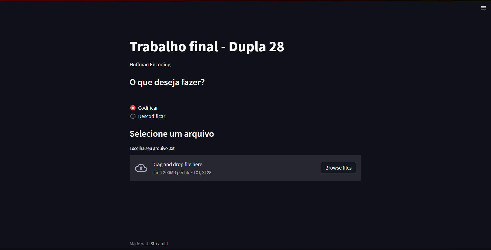
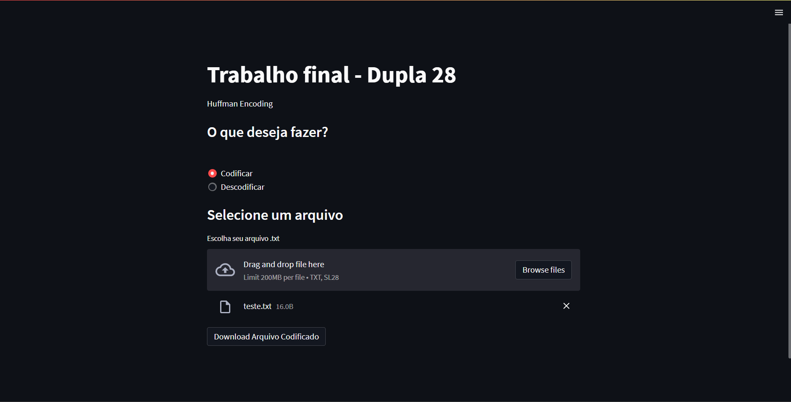
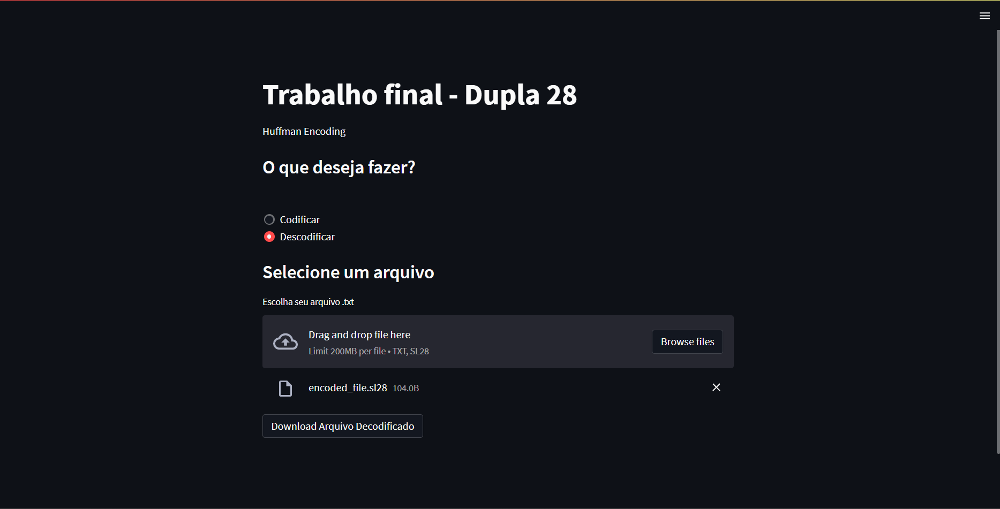

# EncondigText

**Número da Lista**: 28<br>
**Conteúdo da Disciplina**: Projeto Final<br>

## Alunos
|Matrícula | Aluno |
| -- | -- |
| 19/0037997  |  Sidney Fernando F. Lemes |
| 21/2005426  |  Lucas Gomes Caldas |

## Sobre 
O projeto objetiva apresentar a opção de codificar um texto usando codificação de Huffman e também decodificá-lo 

## Screenshots





## Instalação 
**Linguagem**: Python 3<br>
- ```$ pip install -r requirements.txt```
- ```$ streamlit run interface.py``` ou ```$ python -m streamlit run interface.py ```

## Uso 
- Selecione "codificar" e coloque um arquivo txt com algo escrito. Faça download do arquivo .sl28 (formato fictício para fim de distinção).
- Selecione decodificar e coloque um arquivo .sl28. Faça download do arquivo txt com o texto correto

## Apresentação
[Link Apresentação - Youtube](https://youtu.be/zjLStk-39AA)